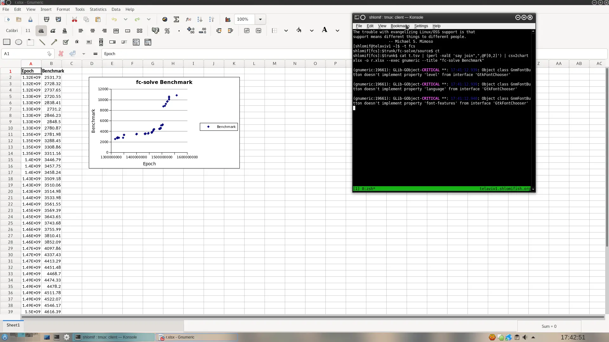

# NAME

App::CSV2Chart - generate charts on the command line.

# Screenshots

# SYNOPSIS

    ( echo "time,value" ; echo -n $'1,24\n2,36\n3,1977') | \
        csv2chart xlsx --output spreadsheet.xlsx \
            --exec gnumeric \
            --title "Values vs. Times"

# COPYRIGHT & LICENSE

Copyright 2019 by Shlomi Fish

This program is distributed under the MIT / Expat License:
http://www.opensource.org/licenses/mit-license.php

# SUPPORT

## Websites

The following websites have more information about this module, and may be of help to you. As always,
in addition to those websites please use your favorite search engine to discover more resources.

- MetaCPAN

A modern, open-source CPAN search engine, useful to view POD in HTML format.

https://metacpan.org/release/App-CSV2Chart

- CPAN Ratings

The CPAN Ratings is a website that allows community ratings and reviews of Perl modules.

http://cpanratings.perl.org/d/App-CSV2Chart

- CPANTS

The CPANTS is a website that analyzes the Kwalitee ( code metrics ) of a distribution.

http://cpants.cpanauthors.org/dist/App-CSV2Chart

- CPAN Testers

The CPAN Testers is a network of smoke testers who run automated tests on uploaded CPAN distributions.

http://www.cpantesters.org/distro/A/App-CSV2Chart

- CPAN Testers Matrix

The CPAN Testers Matrix is a website that provides a visual overview of the test results for a distribution on various Perls/platforms.

http://matrix.cpantesters.org/?dist=App-CSV2Chart

- CPAN Testers Dependencies

The CPAN Testers Dependencies is a website that shows a chart of the test results of all dependencies for a distribution.

http://deps.cpantesters.org/?module=App::CSV2Chart

## Source Code

The code is open to the world, and available for you to hack on. Please feel free to browse it and play
with it, or whatever. If you want to contribute patches, please send me a diff or prod me to pull
from your repository :)

https://github.com/shlomif/CSV2Chart

    git clone https://github.com/shlomif/CSV2Chart.git

# AUTHOR

[Shlomi Fish](https://www.shlomifish.org/)

# SEE ALSO

- [csv2chart in Java](https://github.com/eobermuhlner/csv2chart) - supports many types of charts and SVG (or PNG) output, but cannot emit .xlsx files.
